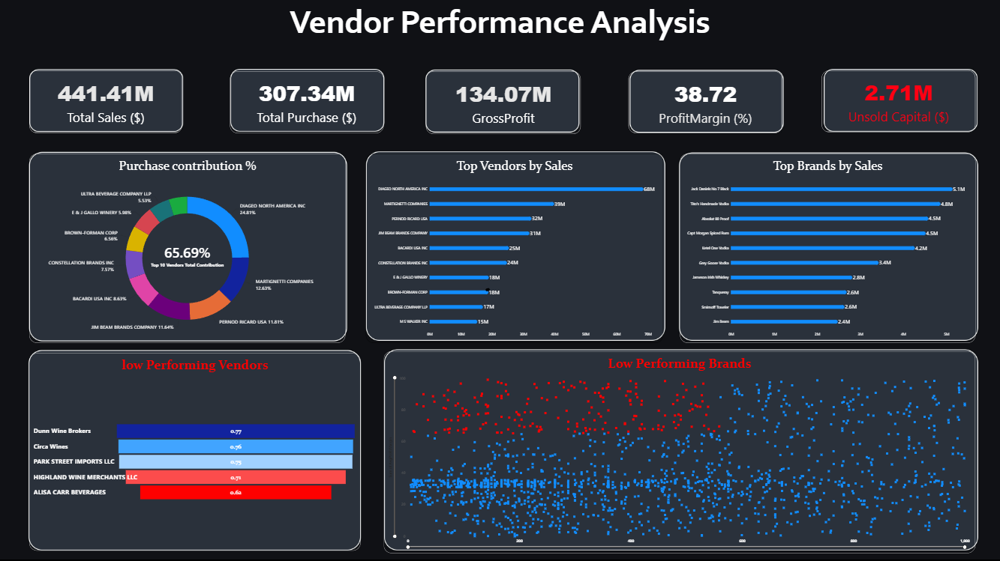

# 🧾 Vendor Performance Analysis | SQL, Python & Power BI

> **Analyzing vendor efficiency, profitability, purchasing patterns, and inventory performance to support strategic business decisions.**

This project performs an end-to-end analysis of retail vendor and inventory data using **SQL, Python, and Power BI**.

The project combines data ingestion, SQL-based transformation, exploratory data analysis, statistical testing, business analysis, and interactive dashboarding to identify vendor performance patterns, inventory inefficiencies, purchasing opportunities, and profitability insights.

---

## 📌 Table of Contents

* [Overview](#overview)
* [Business Problem](#business-problem)
* [Project Objectives](#project-objectives)
* [Dataset](#dataset)
* [Dataset Setup](#dataset-setup)
* [Tools & Technologies](#tools--technologies)
* [Project Structure](#project-structure)
* [Data Pipeline](#data-pipeline)
* [Data Cleaning & Preparation](#data-cleaning--preparation)
* [Exploratory Data Analysis](#exploratory-data-analysis)
* [Research Questions & Key Findings](#research-questions--key-findings)
* [Power BI Dashboard](#power-bi-dashboard)
* [How to Run This Project](#how-to-run-this-project)
* [Business Recommendations](#business-recommendations)
* [Project Report](#project-report)
* [Author](#author)

---

<h2><a class="anchor" id="overview"></a>📊 Overview</h2>

Vendor performance has a direct impact on purchasing costs, inventory levels, sales, and profitability.

This project analyzes retail inventory, purchasing, sales, pricing, and vendor information to understand:

* Which vendors and brands are performing well
* Which brands have high margins but low sales
* How purchasing quantities affect unit costs
* How much inventory remains unsold
* Whether the business is overly dependent on a small number of vendors
* How vendor performance differs in terms of profitability
* Which areas require pricing, purchasing, or inventory optimization

The analysis uses **SQL for data ingestion and transformation, Python for statistical analysis and visualization, and Power BI for interactive reporting**.

---

<h2><a class="anchor" id="business-problem"></a>🎯 Business Problem</h2>

Retail businesses need to balance purchasing costs, inventory availability, sales performance, and profitability.

The objective of this project is to answer important business questions such as:

* Which vendors contribute the most to total purchases and sales?
* Which brands have strong margins but weak sales performance?
* Does purchasing in larger quantities reduce the unit purchase cost?
* How much capital is tied up in unsold inventory?
* Are there vendors with significantly different profit margins?
* Is the business overly dependent on a small number of vendors?
* Which vendors or products require strategic attention?

The analysis converts these questions into measurable metrics and actionable business recommendations.

---

<h2><a class="anchor" id="project-objectives"></a>🚀 Project Objectives</h2>

The main objectives of this project are to:

1. Analyze vendor-level sales and profitability.
2. Identify underperforming brands with potential for promotions or repricing.
3. Evaluate purchasing patterns and bulk-order benefits.
4. Measure unsold inventory and inventory turnover.
5. Analyze vendor concentration and dependency risk.
6. Compare profitability across different vendor groups.
7. Perform statistical hypothesis testing on vendor profitability.
8. Build an interactive Power BI dashboard for business users.
9. Provide data-driven recommendations for purchasing and inventory decisions.

---

<h2><a class="anchor" id="dataset"></a>🗂️ Dataset</h2>

The project uses a retail inventory and sales dataset consisting of multiple CSV files.

The dataset contains information related to:

* Beginning inventory
* Ending inventory
* Purchases
* Sales
* Purchase prices
* Vendor invoices

### Dataset Files

The analysis uses the following seven CSV files:

| File                       | Description                        |
| -------------------------- | ---------------------------------- |
| `begin_inventory.csv`      | Beginning inventory information    |
| `purchase_prices.csv`      | Product purchase price information |
| `end_inventory.csv`        | Ending inventory information       |
| `vendor_invoice.csv`       | Vendor invoice information         |
| `purchases.csv`            | Purchase transaction data          |
| `sales.csv`                | Sales transaction data             |

The notebook automatically processes the CSV files and loads them into a SQLite database for analysis.

---

<h2><a class="anchor" id="dataset-setup"></a>📥 Dataset Setup</h2>

The dataset files are too large to store directly in this GitHub repository.

You can download the complete dataset from the Google Drive folder below:

### 🔗 [Download Dataset](https://drive.google.com/drive/folders/1BuNqollvNb4K-WI9PwlrQua9yiaNgFEh?usp=drive_link)

After downloading the dataset, create a `dataset` folder in the root directory of the project and place all seven CSV files inside it.

Your project should look like this:

```text
vendor-performance-analysis-sql-python-powerbi/
│
├── dataset/
│   ├── begin_inventory.csv
│   ├── purchase_prices.csv
│   ├── end_inventory.csv
│   ├── vendor_invoice.csv
│   ├── vendor_sales_summary.csv
│   ├── purchases.csv
│   └── sales.csv
│
├── notebook/
│   └── vendor_analysis.ipynb
│
├── dashboard/
│   └── vendor_performance_dashboard.pbix
│
├── README.md
├── requirements.txt
└── .gitignore
```

> **Important:** All seven CSV files must be placed inside the `dataset/` folder before running the notebook.

### Dataset Size

The dataset contains several large CSV files. In the notebook's ingestion output:

* `begin_inventory.csv` is approximately 16.64 MB
* `purchase_prices.csv` is approximately 1 MB
* `end_inventory.csv` is approximately 18.10 MB
* `vendor_invoice.csv` is approximately 0.49 MB
* `vendor_sales_summary.csv` is approximately 2.04 MB
* `purchases.csv` is approximately 344.83 MB
* `sales.csv` is approximately 1.52 GB

Because of the dataset size, the raw CSV files are intentionally hosted separately rather than committed to GitHub.

---

<h2><a class="anchor" id="tools--technologies"></a>🛠️ Tools & Technologies</h2>

### SQL

* SQLite
* SQLAlchemy
* SQL queries
* Joins
* Aggregations
* Filtering
* Common Table Expressions

### Python

* Python
* Pandas
* NumPy
* Matplotlib
* Seaborn
* SciPy
* SQLAlchemy

### Business Intelligence

* Microsoft Power BI
* Power BI Dashboard
* Interactive visualizations
* KPI analysis

### Development

* Jupyter Notebook
* Git
* GitHub

---

<h2><a class="anchor" id="project-structure"></a>📁 Project Structure</h2>

```text
vendor-performance-analysis-sql-python-powerbi/
│
├── README.md
├── requirements.txt
├── .gitignore
│
├── dataset/
│   ├── begin_inventory.csv
│   ├── purchase_prices.csv
│   ├── end_inventory.csv
│   ├── vendor_invoice.csv
│   ├── vendor_sales_summary.csv
│   ├── purchases.csv
│   └── sales.csv
│
├── notebook/
│   └── vendor_analysis.ipynb
│
├── dashboard/
│   └── vendor_performance_dashboard.pbix
│
└── images/
    └── dashboard.png
```

> The raw dataset is not included in the GitHub repository because of its size. Download it separately using the link provided in the [Dataset Setup](#dataset-setup) section.

---

<h2><a class="anchor" id="data-pipeline"></a>🔄 Data Pipeline</h2>

The project follows an end-to-end analytical workflow:

```text
Raw CSV Dataset
       │
       ▼
Data Ingestion
       │
       ▼
SQLite Database
       │
       ▼
SQL Transformation
       │
       ▼
Vendor Summary / Analytical Tables
       │
       ▼
Python Analysis
       │
       ├── EDA
       ├── Correlation Analysis
       ├── Outlier Detection
       └── Hypothesis Testing
       │
       ▼
Business Insights
       │
       ▼
Power BI Dashboard
       │
       ▼
Business Recommendations
```

The notebook uses chunk-based CSV ingestion to process large files without attempting to load the entire dataset into memory at once.

---

<h2><a class="anchor" id="data-cleaning--preparation"></a>🧹 Data Cleaning & Preparation</h2>

The analysis includes several data preparation and filtering steps.

### Data Cleaning

* Loaded multiple CSV datasets.
* Ingested large CSV files into SQLite using chunks.
* Converted relevant columns to appropriate data types.
* Joined related datasets.
* Created vendor-level summary information.
* Identified missing and inconsistent values.
* Examined extreme values and outliers.

### Business-Level Filtering

The analysis also evaluates transactions involving:

* Gross Profit ≤ 0
* Profit Margin ≤ 0
* Sales Quantity = 0

These conditions were investigated to identify loss-making transactions, zero-sales situations, and other unusual business cases.

---

<h2><a class="anchor" id="exploratory-data-analysis"></a>🔍 Exploratory Data Analysis</h2>

The exploratory analysis focuses on sales, purchasing, inventory, pricing, and profitability.

### Negative or Zero Values

The analysis identified:

* Minimum Gross Profit of approximately **-52,002.78**
* Negative or undefined profit margins in certain transactions
* Unsold inventory representing slow-moving or inactive stock

### Outliers

Several significant outliers were identified, including:

* High freight costs reaching approximately **257K**
* Large purchase quantities
* Large purchase and actual prices
* Unusually high-value transactions

### Correlation Analysis

The analysis identified several relationships between variables:

| Variables                           | Relationship                |
| ----------------------------------- | --------------------------- |
| Purchase Quantity vs Sales Quantity | Strong positive correlation |
| Purchase Price vs Profit            | Weak relationship           |
| Profit Margin vs Sales Price        | Negative relationship       |

The correlation between Purchase Quantity and Sales Quantity was approximately **0.999**, indicating a very strong positive relationship in the analyzed dataset.

---

<h2><a class="anchor" id="research-questions--key-findings"></a>📈 Research Questions & Key Findings</h2>

### 1. Which brands should be considered for promotions?

The analysis identified **198 brands** with relatively low sales but high profit margins.

These brands may represent opportunities for targeted promotions, improved visibility, or pricing adjustments.

---

### 2. How concentrated are purchases among vendors?

The top 10 vendors account for approximately **65.69% of total purchases**.

This indicates a potential vendor concentration risk because a large proportion of purchasing activity depends on a relatively small number of vendors.

---

### 3. Does bulk purchasing reduce costs?

The analysis identified approximately **72% cost savings per unit** associated with larger purchasing quantities.

This suggests that bulk purchasing can provide significant unit-cost advantages when inventory demand and storage capacity support larger orders.

---

### 4. How much capital is tied up in unsold inventory?

The analysis identified approximately **$2.71M worth of unsold inventory**.

This represents capital that may be tied up in slow-moving stock and highlights an opportunity to improve inventory management.

---

### 5. How does profitability differ between vendor groups?

The analysis compared high-performing and low-performing vendor groups.

| Vendor Group | Mean Profit Margin |
| ------------ | -----------------: |
| High Vendors |             31.17% |
| Low Vendors  |             41.55% |

The results indicate that vendor classification does not necessarily correspond directly to higher average profit margins, highlighting the importance of analyzing vendor performance using multiple metrics rather than sales volume alone.

---

### 6. Is the difference in vendor profitability statistically significant?

Hypothesis testing was performed to determine whether the observed differences in vendor profitability were statistically meaningful.

The analysis indicated a **statistically significant difference in profit margins between the evaluated vendor groups**, suggesting that the groups may follow different profitability patterns or vendor strategies.

---

<h2><a class="anchor" id="power-bi-dashboard"></a>📊 Power BI Dashboard</h2>

The Power BI dashboard converts the analysis into an interactive business reporting layer.

### Dashboard Areas

The dashboard focuses on:

* Vendor-wise Sales
* Vendor Profit Margins
* Inventory Performance
* Unsold Inventory
* Bulk Purchase Savings
* Vendor Contribution
* Performance Comparisons
* Business KPIs
* Performance Heatmaps

### Dashboard Preview



The dashboard allows users to explore vendor and inventory performance from different business perspectives.

---

<h2><a class="anchor" id="how-to-run-this-project"></a>▶️ How to Run This Project</h2>

### 1. Clone the repository

```bash
git clone https://github.com/PritishMete/vendor-performance-analysis-sql-python-powerbi.git
```

Move into the project directory:

```bash
cd vendor-performance-analysis-sql-python-powerbi
```

---

### 2. Download the dataset

Download the complete dataset from Google Drive:

[Download Dataset](https://drive.google.com/drive/folders/1BuNqollvNb4K-WI9PwlrQua9yiaNgFEh?usp=drive_link)

Extract the downloaded files and place all seven CSV files inside:

```text
dataset/
```

---

### 3. Install Python dependencies

Create a virtual environment if required:

```bash
python -m venv venv
```

Activate it on Windows:

```bash
venv\Scripts\activate
```

Install the required packages:

```bash
pip install -r requirements.txt
```

---

### 4. Open the notebook

Open:

```text
notebook/vendor_analysis.ipynb
```

You can run it using Jupyter Notebook, JupyterLab, or Google Colab.

The notebook performs the data ingestion and analysis workflow.

---

### 5. Run the analysis

Run the notebook cells in order.

The ingestion process reads the CSV files from the dataset directory and loads them into a SQLite database for further analysis.

The expected tables include:

```text
begin_inventory
purchase_prices
end_inventory
vendor_invoice
vendor_sales_summary
purchases
sales
```

---

### 6. Open the Power BI Dashboard

Open:

```text
dashboard/vendor_performance_dashboard.pbix
```

If Power BI requests the dataset location, point it to the appropriate local dataset/database location created during the project setup.

---

<h2><a class="anchor" id="business-recommendations"></a>💡 Business Recommendations</h2>

Based on the analysis, several business actions can be considered.

### 1. Diversify the Vendor Base

Since the top 10 vendors account for approximately 65.69% of purchases, management should evaluate opportunities to diversify the vendor base and reduce dependency risk.

### 2. Optimize Bulk Purchasing

Bulk purchasing can provide significant unit-cost savings. However, larger purchases should be aligned with demand forecasts and available storage capacity to avoid excessive unsold inventory.

### 3. Promote High-Margin, Low-Sales Brands

Brands with strong margins but relatively low sales may benefit from:

* Targeted promotions
* Better product placement
* Improved marketing
* Strategic pricing
* Bundling strategies

### 4. Reduce Unsold Inventory

The approximately $2.71M in unsold inventory indicates an opportunity to improve inventory turnover.

Potential actions include:

* Discounting slow-moving products
* Running targeted promotions
* Adjusting future purchase quantities
* Improving demand forecasting
* Reviewing reorder levels

### 5. Monitor Vendor Profitability

Vendor evaluation should not rely only on sales or purchase volume.

Management should consider a combination of:

* Sales
* Profit
* Profit Margin
* Purchase Cost
* Inventory Turnover
* Freight Cost
* Purchase Volume

---

<h2><a class="anchor" id="project-report"></a>📄 Project Report</h2>

A detailed project report is available in the repository:

```text
Vendor Performance Report.pdf
```

The report provides additional context around the analysis, findings, and business recommendations.

---

<h2><a class="anchor" id="author"></a>👨‍💻 Author</h2>

**Pritish Mete**

Data Analyst

📧 Email: `jaiphotoshoot@gmail.com`

🔗 [LinkedIn](https://www.linkedin.com/in/pritish-mete-213a03368/)

🔗 Portfolio: Coming soon

---

## ⭐ If You Found This Project Useful

If you found this project useful or interesting, consider giving the repository a ⭐ on GitHub.

Feedback and suggestions are always welcome.
